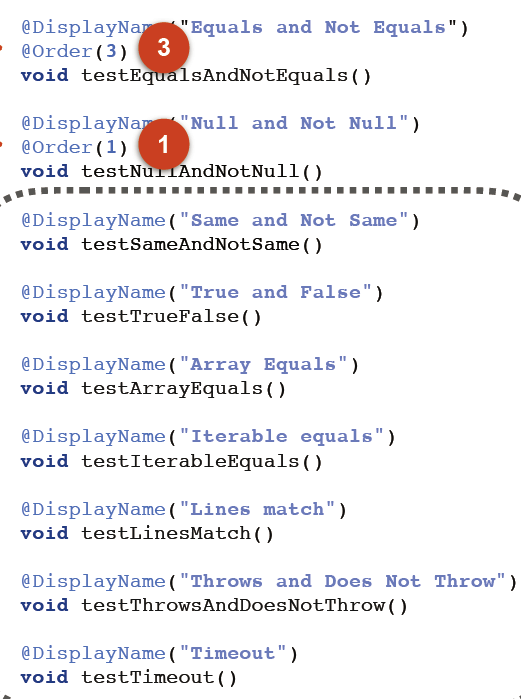
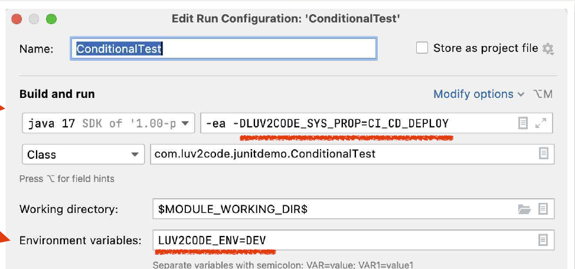
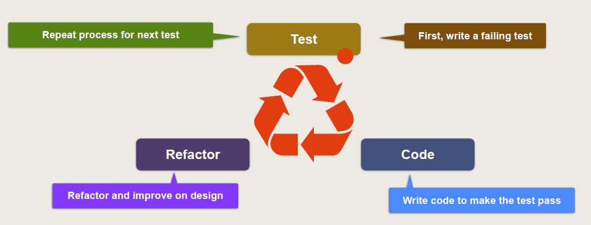
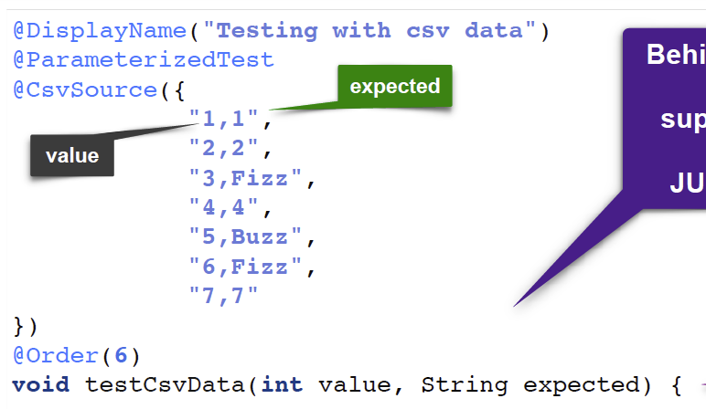
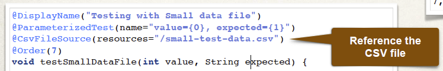

# Develop Real-Time Spring Boot Unit Tests

## Integration Test vs Unit Test

### Integration Test (集成测试) 

Test multiple components together as part of a test plan

• Determine if software units work together as expected
• Identify any negative side effects due to integration
• Can test using mocks / stubs
• Can also test using live integrations (database, file system)

### Unit Test(单元测试)

Testing an individual unit of code for correctness

• Provide fixed inputs
• Expect known output

## Junit 

### Assertions(断言)

| Method Name     | DESCRIPTION                         |
| :-------------- | ----------------------------------- |
| assertEquals    | Assert that the value are equal     |
| assertNotEquals | Assert that the value are not equal |
| assertNull      | Assert that the value is null       |
| assertNotNull   | Assert that the value is not null   |

### Static Import

```java
import static org.junit.jupiter.api.Assertions.*;
```

```Java
// Assertions.assertEquals(expected, actual, "2 + 4 must be 6");
assertEquals(expected, actual, "2 + 4 must be 6");

```

### Lifecycle Method Annotations


| Annotation  | DESCRIPTION                                                  |
| :---------- | ------------------------------------------------------------ |
| @BeforeAll  | Assert that the value are equal, must be static, be public and return void |
| @AfterAll   | Assert that the value are not equal                          |
| @AfterEach  | Assert that the value is null                                |
| @BeforeEach | Assert that the value is not null                            |

### JUnit Custom Display Names

Provide a more descriptive name for the test

| Annotation   | DESCRIPTION                                                  |
| :----------- | ------------------------------------------------------------ |
| @DisplayName | Custom display name with spaces, special characters and emojis.<br/>Useful for test reports in IDE or external test runner |

#### Display Name Generators

| Name                | DESCRIPTION                                                  |
| :------------------ | ------------------------------------------------------------ |
| Simple              | Removes trailing parentheses from test method name           |
| ReplaceUnderscores  | Replaces underscores in test method name with spaces         |
| IndicativeSentences | Generate sentence based on test class name and test method name |


```java
@DisplayNameGeneration(DisplayNameGenerator.Simple.class)
class DemoUtilsTest {

@DisplayNameGeneration(DisplayNameGenerator.ReplaceUnderscores.class)
class DemoUtilsTest {

@DisplayNameGeneration(DisplayNameGenerator.IndicativeSentences.class)
class DemoUtilsTest {
```


### Same and True


| Method Name   | DESCRIPTION                                   |
| :------------ | --------------------------------------------- |
| assertSame    | Assert that items refer to same object        |
| assertNotSame | Assert that items do not refer to same object |

```java
assertSame(demoUtils.getAcademy(), demoUtils.getAcademyDuplicate(), "Objects should refer to same object");
```

| Method Name | DESCRIPTION                    |
| :---------- | ------------------------------ |
| assertTrue  | Assert that condition is true  |
| assertFalse | Assert that condition is false |

```java
assertTrue(demoUtils.isGreater(gradeOne, gradeTwo), "This should return true");
```

### Arrays, Iterables and Lines

| Method Name          | DESCRIPTION                                                  |
| :------------------- | ------------------------------------------------------------ |
| assertArrayEquals    | Assert that both object arrays are deeply equal              |
| assertIterableEquals | Assert that both object iterables are deeply equal(An "iterable" is an instance of a class that implements the java.lang.Iterable interface) |
| assertLinesMatch     | Assert that both lists of strings match                      |

```java
assertArrayEquals(stringArray, demoUtils.getFirstThreeLettersOfAlphabet(), "Arrays should be the same");
```

### Throws and Timeout

| Method Name               | DESCRIPTION                                                  |
| :------------------------ | ------------------------------------------------------------ |
| assertThrows              | Assert that an executable throws an exception of expected type |
| assertDoesNotThrow        | Assert that an executable does not throw an exception of expected type |
| assertTimeoutPreemptively | Assert that an executable completes before given timeout is exceeded |

```
assertTimeoutPreemptively(Duration.ofSeconds(3), () -> { demoUtils.checkTimeout(); },
"Method should execute in 3 seconds");
```

### Running Tests in Order

By default, test classes and methods will be ordered using an algorithm that is deterministic but intentionally nonobvious.

| Annotation       | DESCRIPTION                                              |
| :--------------- | -------------------------------------------------------- |
| @TestMethodOrder | Configures the order/sort algorithm for the test methods |

| Name                          | DESCRIPTION                                                |
| :---------------------------- | ---------------------------------------------------------- |
| MethodOrderer.DisplayName     | Sorts test methods alphanumerically based on display names |
| MethodOrderer.MethodName      | Sorts test methods alphanumerically based on method names  |
| MethodOrderer.Random          | Pseudo-random order based on method names                  |
| MethodOrderer.OrderAnnotation | Sorts test methods numerically based on @Order annotation  |

```java
@TestMethodOrder(MethodOrderer.DisplayName.class)
class DemoUtilsTest {
```

| Annotation | DESCRIPTION                                                  |
| :--------- | ------------------------------------------------------------ |
| @Order     | Manually specify the order with an int number<br/>- Order with lowest number has highest priority<br/>- Negative numbers are allowed |




### Code Coverage and Test Reports
with IntelliJ

Code Coverage measures how many methods/lines are called by your tests

On most teams, 70%-80% is acceptable

### Conditional Tests

| Name                          | DESCRIPTION                                          |
| :---------------------------- | ---------------------------------------------------- |
| @Disabled                     | Disable a test method                                |
| @EnabledOnOs                  | Enable test when running on a given operating system |
| @EnabledOnJre                 | Enable test for a given Java version                 |
| @EnabledForJreRange           | Enable test for a given Java version range           |
| @EnabledIfSystemProperty      | Enable test based on system property                 |
| @EnabledIfEnvironmentVariable | Enable test based on environment variable            |

```java
@EnabledOnJre(JRE.JAVA_13)
@EnabledForJreRange(min=JRE.JAVA_13, max=JRE.JAVA_18)
@EnabledIfSystemProperty(named="LUV2CODE_SYS_PROP", matches="CI_CD_DEPLOY")
@EnabledIfEnvironmentVariable(named="LUV2CODE_ENV", matches="DEV")
```



## TDD



### 

| Name           | DESCRIPTION                                         |
| :------------- | --------------------------------------------------- |
| @ValueSource   | Array of values: Strings, ints, doubles, floats etc |
| @CsvSource     | Array of CSV String values                          |
| @CsvFileSource | CSV values read from a file                         |
| @EnumSource    | Enum constant values                                |
| @MethodSource  | Custom method for providing values                  |





```java
@ParameterizedTest
@MethodSource("provideStringsForIsBlank")
void isBlank_ShouldReturnTrueForNullOrBlankStrings(String input, boolean expected) {
    assertEquals(expected, Strings.isBlank(input));
}

private static Stream<Arguments> provideStringsForIsBlank() {
    return Stream.of(
      Arguments.of(null, true),
      Arguments.of("", true),
      Arguments.of("  ", true),
      Arguments.of("not blank", false)
    );
}
```

## SpringBoot Test

1. Add Maven dependency

   ```xml
   		<dependency>
   			<groupId>org.springframework.boot</groupId>
   			<artifactId>spring-boot-starter-test</artifactId>
   			<scope>test</scope>
   		</dependency>
   ```

   

2. Create Test folder and add @SpringBootTest before the class.

   ```java
   @SpringBootTest
   public class ApplicationExampleTest {
   
       @Test
       void basicTest() {
   
       }
   }
   ```

3. If the package name in test folder is different from the main, add:

   ```java
   @SpringBootTest(classes = MvcTestingExampleApplication.class)
   ```

   

Something New:

```java
assertAll()
//test all method at once

assertAll("Testing all aseertEquals",
	()-> assertEquals(...),
	()-> assertEquals(...)
)
	

```


## Mockit


Steps:

1. Create Mock for DAO

2. Inject mock into Service (After this, the mock DAO created in step 1 will be used to create the Service)

3. Setup expectations

4. Call method under test and assert results

5. Verify method calls

   ```java
   @SpringBootTest(classes = MvcTestingExampleApplication.class)
   public class MockAnnotationTest {
       @Autowired
       ApplicationContext context;
   
       @Autowired
       CollegeStudent studentOne;
   
       @Autowired
       StudentGrades studentGrades;
   
       @Mock
       private ApplicationDao applicationDAO;
   
       @InjectMocks
       private ApplicationService applicationService;
   
       @BeforeEach
       public void beforeEach() {
           studentOne.setFirstname("Chad");
           studentOne.setLastname("Darby");
           studentOne.setEmailAddress("chad.darby@luv2code_school.com");
           studentOne.setStudentGrades(studentGrades);
       }
   
       @DisplayName("When & Verify")
       @Test
       public void assertEqualsTestAddGrades() {
           when(applicationDAO.addGradeResultsForSingleClass(
                   studentGrades.getMathGradeResults())).thenReturn(100.00);
   
           assertEquals(100, applicationService.addGradeResultsForSingleClass(
                   studentOne.getStudentGrades().getMathGradeResults()));
   
           verify(applicationDAO).addGradeResultsForSingleClass(studentGrades.getMathGradeResults());
   
           verify(applicationDAO, times(1)).addGradeResultsForSingleClass(
                   studentGrades.getMathGradeResults());
       }
   ```

   

### MockBean

Using @MockBean to replace @Mock, so you do not need to use @InjectMocks anymore. Just use @Autowired.

```java
    // @Mock
    @MockBean
    private ApplicationDao applicationDao;

    // @InjectMocks
    @Autowired
    private ApplicationService applicationService;
```

### MockitException

```java
    @DisplayName("Multiple Stubbing")
    @Test
    public void stubbingConsecutiveCalls() {
        CollegeStudent nullStudent = (CollegeStudent) context.getBean("collegeStudent");

        when(applicationDAO.checkNull(nullStudent))
                .thenThrow(new RuntimeException())
                .thenReturn("Do not throw exception second time");

        assertThrows(RuntimeException.class, () -> {
            applicationService.checkNull(nullStudent);
        });

        assertEquals("Do not throw exception second time",
                applicationService.checkNull(nullStudent));

        verify(applicationDAO, times(2)).checkNull(nullStudent);
    }
```


## @sql

Use @Sql("/test-schema.sql") on the top of the method, the SQL script will run before the method called.


## REST APIs VS MVC test

Very similar to MVC Test, just a few small difference:


```java
package com.luv2code.springmvc;

import com.fasterxml.jackson.databind.ObjectMapper;
import com.luv2code.springmvc.models.CollegeStudent;
import com.luv2code.springmvc.models.MathGrade;
import com.luv2code.springmvc.repository.HistoryGradesDao;
import com.luv2code.springmvc.repository.MathGradesDao;
import com.luv2code.springmvc.repository.ScienceGradesDao;
import com.luv2code.springmvc.repository.StudentDao;
import com.luv2code.springmvc.service.StudentAndGradeService;
import org.junit.jupiter.api.AfterEach;
import org.junit.jupiter.api.BeforeAll;
import org.junit.jupiter.api.BeforeEach;
import org.junit.jupiter.api.Test;
import org.mockito.Mock;
import org.springframework.beans.factory.annotation.Autowired;
import org.springframework.beans.factory.annotation.Value;
import org.springframework.boot.test.autoconfigure.web.servlet.AutoConfigureMockMvc;
import org.springframework.boot.test.context.SpringBootTest;
import org.springframework.http.MediaType;
import org.springframework.jdbc.core.JdbcTemplate;
import org.springframework.mock.web.MockHttpServletRequest;
import org.springframework.test.context.TestPropertySource;
import org.springframework.test.web.servlet.MockMvc;
import org.springframework.test.web.servlet.request.MockMvcRequestBuilders;
import org.springframework.transaction.annotation.Transactional;

import javax.persistence.EntityManager;
import javax.persistence.PersistenceContext;
import java.util.Optional;

import static org.hamcrest.Matchers.hasSize;
import static org.hamcrest.Matchers.is;
import static org.junit.jupiter.api.Assertions.*;
import static org.springframework.test.web.servlet.request.MockMvcRequestBuilders.post;
import static org.springframework.test.web.servlet.result.MockMvcResultMatchers.*;

@TestPropertySource("/application-test.properties")
@AutoConfigureMockMvc
@SpringBootTest
@Transactional
public class GradebookControllerTest {

    private static MockHttpServletRequest request;

    @PersistenceContext
    private EntityManager entityManager;

    @Mock
    StudentAndGradeService studentCreateServiceMock;

    @Autowired
    private JdbcTemplate jdbc;

    @Autowired
    private StudentDao studentDao;

    @Autowired
    private MathGradesDao mathGradeDao;

    @Autowired
    private ScienceGradesDao scienceGradeDao;

    @Autowired
    private HistoryGradesDao historyGradeDao;

    @Autowired
    private StudentAndGradeService studentService;

    @Autowired
    private MockMvc mockMvc;

    @Autowired
    ObjectMapper objectMapper;

    @Autowired
    private CollegeStudent student;

    @Value("${sql.script.create.student}")
    private String sqlAddStudent;

    @Value("${sql.script.create.math.grade}")
    private String sqlAddMathGrade;

    @Value("${sql.script.create.science.grade}")
    private String sqlAddScienceGrade;

    @Value("${sql.script.create.history.grade}")
    private String sqlAddHistoryGrade;

    @Value("${sql.script.delete.student}")
    private String sqlDeleteStudent;

    @Value("${sql.script.delete.math.grade}")
    private String sqlDeleteMathGrade;

    @Value("${sql.script.delete.science.grade}")
    private String sqlDeleteScienceGrade;

    @Value("${sql.script.delete.history.grade}")
    private String sqlDeleteHistoryGrade;

    public static final MediaType APPLICATION_JSON_UTF8 = MediaType.APPLICATION_JSON;


    @BeforeAll
    public static void setup() {

        request = new MockHttpServletRequest();

        request.setParameter("firstname", "Chad");

        request.setParameter("lastname", "Darby");

        request.setParameter("emailAddress", "chad.darby@luv2code_school.com");
    }

    @BeforeEach
    public void setupDatabase() {
        jdbc.execute(sqlAddStudent);
        jdbc.execute(sqlAddMathGrade);
        jdbc.execute(sqlAddScienceGrade);
        jdbc.execute(sqlAddHistoryGrade);
    }

    @Test
    public void getStudentsHttpRequest() throws Exception {

        student.setFirstname("Chad");
        student.setLastname("Darby");
        student.setEmailAddress("chad.darby@luv2code_school.com");
        entityManager.persist(student);
        entityManager.flush();

        mockMvc.perform(MockMvcRequestBuilders.get("/"))
                .andExpect(status().isOk())
                .andExpect(content().contentType(APPLICATION_JSON_UTF8))
                .andExpect(jsonPath("$", hasSize(2)));

    }

    @Test
    public void createStudentHttpRequest() throws Exception {
        student.setFirstname("Chad");
        student.setLastname("Darby");
        student.setEmailAddress("chad_darby@luv2code_school.com");

        mockMvc.perform(post("/")
                        .contentType(MediaType.APPLICATION_JSON)
                        .content(objectMapper.writeValueAsString(student)))
                .andExpect(status().isOk())
                .andExpect(jsonPath("$", hasSize(2)));

        CollegeStudent verifyStudent = studentDao.findByEmailAddress("chad_darby@luv2code_school.com");
        assertNotNull(verifyStudent, "Student should be valid.");
    }

    @Test
    public void deleteStudentHttpRequest() throws Exception {
        assertTrue(studentDao.findById(1).isPresent());

        mockMvc.perform(MockMvcRequestBuilders.delete("/student/{id}", 1))
                .andExpect(status().isOk())
                .andExpect(content().contentType(APPLICATION_JSON_UTF8))
                .andExpect(jsonPath("$", hasSize(0)));

        assertFalse(studentDao.findById(1).isPresent());
    }

    @Test
    public void deleteStudentHttpRequestErrorPage() throws Exception {
        assertFalse(studentDao.findById(0).isPresent());

        mockMvc.perform(MockMvcRequestBuilders.delete("/student/{id}", 0))
                .andExpect(status().is4xxClientError())
                .andExpect(jsonPath("$.status", is(404)))
                .andExpect(jsonPath("$.message", is("Student or Grade was not found")));

    }

    @Test
    public void studentInformationHttpRequest() throws Exception {

        Optional<CollegeStudent> student = studentDao.findById(1);

        assertTrue(student.isPresent());

        mockMvc.perform(MockMvcRequestBuilders.get("/studentInformation/{id}", 1))
                .andExpect(status().isOk())
                .andExpect(content().contentType(APPLICATION_JSON_UTF8))
                .andExpect(jsonPath("$.id", is(1)))
                .andExpect(jsonPath("$.firstname", is("Eric")))
                .andExpect(jsonPath("$.lastname", is("Roby")))
                .andExpect(jsonPath("$.emailAddress", is("eric.roby@luv2code_school.com")));
    }

    @Test
    public void studentInformationHttpRequestEmptyResponse() throws Exception {

        Optional<CollegeStudent> student = studentDao.findById(0);

        assertFalse(student.isPresent());

        mockMvc.perform(MockMvcRequestBuilders.get("/studentInformation/{id}", 0))
                .andExpect(status().is4xxClientError())
                .andExpect(jsonPath("$.status", is(404)))
                .andExpect(jsonPath("$.message", is("Student or Grade was not found")));
    }

    @Test
    public void createAValidGradeHttpRequest() throws Exception {

        mockMvc.perform(post("/grades")
                        .contentType(MediaType.APPLICATION_JSON)
                        .param("grade", "85.00")
                        .param("gradeType", "math")
                        .param("studentId", "1"))
                .andExpect(status().isOk())
                .andExpect(content().contentType(APPLICATION_JSON_UTF8))
                .andExpect(jsonPath("$.id", is(1)))
                .andExpect(jsonPath("$.firstname", is("Eric")))
                .andExpect(jsonPath("$.lastname", is("Roby")))
                .andExpect(jsonPath("$.emailAddress", is("eric.roby@luv2code_school.com")))
                .andExpect(jsonPath("$.studentGrades.mathGradeResults", hasSize(2)));
    }

    @Test
    public void createAValidGradeHttpRequestStudentDoesNotExistEmptyResponse() throws Exception {

        mockMvc.perform(post("/grades")
                        .contentType(MediaType.APPLICATION_JSON)
                        .param("grade", "85.00")
                        .param("gradeType", "math")
                        .param("studentId", "0"))
                .andExpect(status().is4xxClientError())
                .andExpect(jsonPath("$.status", is(404)))
                .andExpect(jsonPath("$.message", is("Student or Grade was not found")));
    }

    @Test
    public void createANonValidGradeHttpRequestGradeTypeDoesNotExistEmptyResponse() throws Exception {

        mockMvc.perform(post("/grades")
                        .contentType(MediaType.APPLICATION_JSON)
                        .param("grade", "85.00")
                        .param("gradeType", "literature")
                        .param("studentId", "1"))
                .andExpect(status().is4xxClientError())
                .andExpect(jsonPath("$.status", is(404)))
                .andExpect(jsonPath("$.message", is("Student or Grade was not found")));
    }

    @Test
    public void deleteAValidGradeHttpRequest() throws Exception {

        Optional<MathGrade> mathGrade = mathGradeDao.findById(1);

        assertTrue(mathGrade.isPresent());

        mockMvc.perform(MockMvcRequestBuilders.delete("/grades/{id}/{gradeType}", 1 , "math"))
                .andExpect(status().isOk())
                .andExpect(content().contentType(APPLICATION_JSON_UTF8))
                .andExpect(jsonPath("$.id", is(1)))
                .andExpect(jsonPath("$.firstname", is("Eric")))
                .andExpect(jsonPath("$.lastname", is("Roby")))
                .andExpect(jsonPath("$.emailAddress", is("eric.roby@luv2code_school.com")))
                .andExpect(jsonPath("$.studentGrades.mathGradeResults", hasSize(0)));
    }

    @Test
    public void deleteANonValidGradeHttpRequest() throws Exception {

        mockMvc.perform(MockMvcRequestBuilders.delete("/grades/{id}/{gradeType}", 1 , "literature"))
                .andExpect(status().is4xxClientError())
                .andExpect(jsonPath("$.status", is(404)))
                .andExpect(jsonPath("$.message", is("Student or Grade was not found")));
    }

    @AfterEach
    public void setupAfterTransaction() {
        jdbc.execute(sqlDeleteStudent);
        jdbc.execute(sqlDeleteMathGrade);
        jdbc.execute(sqlDeleteScienceGrade);
        jdbc.execute(sqlDeleteHistoryGrade);
    }
    
}

```

```java
package com.luv2code.springmvc;

import com.luv2code.springmvc.models.*;
import com.luv2code.springmvc.repository.HistoryGradesDao;
import com.luv2code.springmvc.repository.MathGradesDao;
import com.luv2code.springmvc.repository.ScienceGradesDao;
import com.luv2code.springmvc.repository.StudentDao;
import com.luv2code.springmvc.service.StudentAndGradeService;
import org.junit.jupiter.api.AfterEach;
import org.junit.jupiter.api.BeforeAll;
import org.junit.jupiter.api.BeforeEach;
import org.junit.jupiter.api.Test;
import org.mockito.Mock;
import org.springframework.beans.factory.annotation.Autowired;
import org.springframework.beans.factory.annotation.Value;
import org.springframework.boot.test.autoconfigure.web.servlet.AutoConfigureMockMvc;
import org.springframework.boot.test.context.SpringBootTest;
import org.springframework.http.MediaType;
import org.springframework.jdbc.core.JdbcTemplate;
import org.springframework.mock.web.MockHttpServletRequest;
import org.springframework.test.context.TestPropertySource;
import org.springframework.test.web.ModelAndViewAssert;
import org.springframework.test.web.servlet.MockMvc;
import org.springframework.test.web.servlet.MvcResult;
import org.springframework.test.web.servlet.request.MockMvcRequestBuilders;
import org.springframework.web.servlet.ModelAndView;

import javax.persistence.EntityManager;
import javax.persistence.PersistenceContext;
import javax.transaction.Transactional;
import java.util.ArrayList;
import java.util.Arrays;
import java.util.List;
import java.util.Optional;

import static org.junit.jupiter.api.Assertions.*;
import static org.mockito.Mockito.when;
import static org.springframework.test.web.servlet.request.MockMvcRequestBuilders.post;
import static org.springframework.test.web.servlet.result.MockMvcResultMatchers.status;


// @ExtendWith(SpringExtension.class)
// @ContextHierarchy({@ContextConfiguration(classes = MvcTestingExampleApplication.class)})
// @ActiveProfiles("test")
// @DirtiesContext(classMode = ClassMode.AFTER_EACH_TEST_METHOD)
// @TestExecutionListeners({DependencyInjectionTestExecutionListener.class, TransactionalTestExecutionListener.class})
// @WebAppConfiguration
// @Transactional
@TestPropertySource("/application-test.properties")
@AutoConfigureMockMvc
@SpringBootTest
public class GradebookControllerTest {

	private static MockHttpServletRequest request ;

	@Autowired
	private JdbcTemplate jdbc;

	@PersistenceContext
	private EntityManager entityMgr;

	@Autowired
	private StudentDao studentDao;

	@Autowired
	private MathGradesDao mathGradesDao;

	@Autowired
	private ScienceGradesDao scienceGradesDao;

	@Autowired
	private HistoryGradesDao historyGradesDao;

	@Autowired
	private MockMvc mockMvc;

	@Mock
	private StudentAndGradeService studentCreateServiceMock;

	@Autowired
	Gradebook gradebook;

	@Autowired
	CollegeStudent student;

	@Autowired
    StudentAndGradeService studentService;

	@Value("${sql.script.create.student}")
	private String sqlAddStudent;

	@Value("${sql.script.create.math.grade}")
	private String sqlAddMathGrade;

	@Value("${sql.script.create.science.grade}")
	private String sqlAddScienceGrade;

	@Value("${sql.script.create.history.grade}")
	private String sqlAddHistoryGrade;

	@Value("${sql.script.delete.student}")
	private String sqlDeleteStudent;

	@Value("${sql.script.delete.math.grade}")
	private String sqlDeleteMathGrade;

	@Value("${sql.script.delete.science.grade}")
	private String sqlDeleteScienceGrade;

	@Value("${sql.script.delete.history.grade}")
	private String sqlDeleteHistoryGrade;

	@BeforeAll
	public static void setup() {

		request = new MockHttpServletRequest();

		request.setParameter("firstname", "Chad");

		request.setParameter("lastname", "Darby");

		request.setParameter("emailAddress", "chad.darby@luv2code_school.com");

	}
	
	@BeforeEach
	public void each() {
//		MockitoAnnotations.initMocks(this);
		// this.mockMvc = MockMvcBuilders.webAppContextSetup(this.wac).addFilters(new CharacterEncodingFilter()).build();
		jdbc.execute(sqlAddStudent);
		jdbc.execute(sqlAddMathGrade);
		jdbc.execute(sqlAddScienceGrade);
		jdbc.execute(sqlAddHistoryGrade);
	}


	@Transactional
	@Test
	public void getStudentsHttpRequest () throws Exception {

		GradebookCollegeStudent studentOne = new GradebookCollegeStudent("Eric", "Roby",
				"eric_roby@luv2code_school.com");
		studentOne.setStudentGrades(new StudentGrades());
		GradebookCollegeStudent studentTwo = new GradebookCollegeStudent("Chad", "Darby",
				"chad_darby@luv2code_school.com");
		studentTwo.setStudentGrades(new StudentGrades());
		List<GradebookCollegeStudent> students = new ArrayList<>(Arrays.asList(studentOne, studentTwo));
		gradebook.setStudents(students);

		when(studentCreateServiceMock.getGradebook()).thenReturn(gradebook);

		assertEquals("Roby", studentCreateServiceMock.getGradebook().getStudents().get(0).getLastname(), "Id should be 1");
		assertEquals("Chad", studentCreateServiceMock.getGradebook().getStudents().get(1).getFirstname(), "Firstname Chad");

		student.setFirstname("Chad");
		student.setLastname("Darby");
		student.setEmailAddress("chad.darby@luv2code_school.com");
		entityMgr.persist(student);
		entityMgr.flush();

		MvcResult mvcResult = mockMvc.perform(MockMvcRequestBuilders.get("/"))
				.andExpect(status().isOk()).andReturn();

		ModelAndView mav = mvcResult.getModelAndView();
		
		ModelAndViewAssert.assertViewName(mav, "index");
	}
	
	@Test
	public void createStudentHttpRequest () throws Exception {
		
		MvcResult mvcResult = this.mockMvc.perform(post("/")
				.contentType(MediaType.APPLICATION_JSON)
				.param("firstname", request.getParameterValues("firstname"))
			    .param("lastname", request.getParameterValues("lastname"))
				.param("emailAddress", request.getParameterValues("emailAddress")))
				.andExpect(status().isOk())
				.andReturn();
		
		ModelAndView mav = mvcResult.getModelAndView();

		ModelAndViewAssert.assertViewName(mav, "index");

		CollegeStudent verifyStudent = studentDao.findByEmailAddress("chad.darby@luv2code_school.com");

		assertNotNull(verifyStudent, "Student should be found after create");

	}


	@Test
	public void deleteStudentHttpRequest () throws Exception {

		assertTrue(studentDao.findById(1).isPresent());

		MvcResult mvcResult = mockMvc.perform(MockMvcRequestBuilders.get("/delete/student/{id}", 1))
				.andExpect(status().isOk()).andReturn();

		ModelAndView mav = mvcResult.getModelAndView();

		ModelAndViewAssert.assertViewName(mav, "index");

		assertFalse(studentDao.findById(1).isPresent());
	}


	@Test
	public void studentInformationHttpRequest () throws Exception {

		assertTrue(studentDao.findById(1).isPresent());

		MvcResult mvcResult = mockMvc.perform(MockMvcRequestBuilders.get("/studentInformation/{id}", 1))
				.andExpect(status().isOk()).andReturn();

		ModelAndView mav = mvcResult.getModelAndView();

		ModelAndViewAssert.assertViewName(mav, "studentInformation");
	}

	@Test
	public void studentInformationHttpStudentDoesNotExistRequest () throws Exception {

		assertTrue(studentDao.findById(1).isPresent());

		MvcResult mvcResult = mockMvc.perform(MockMvcRequestBuilders.get("/studentInformation/{id}", 1001))
				.andExpect(status().isOk()).andReturn();

		ModelAndView mav = mvcResult.getModelAndView();

		ModelAndViewAssert.assertViewName(mav, "error");
	}


	@Test
	public void createMathGradeHttpRequest () throws Exception {

		assertTrue(studentDao.findById(1).isPresent());

		GradebookCollegeStudent student = studentService.studentInformation(1);

		assertEquals(1, student.getStudentGrades().getMathGradeResults().size());

		MvcResult mvcResult = this.mockMvc.perform(post("/grades")
				.contentType(MediaType.APPLICATION_JSON)
				.param("grade", "85.00")
				.param("gradeType", "math")
				.param("studentId", "1"))
				.andExpect(status().isOk())
				.andReturn();

		ModelAndView mav = mvcResult.getModelAndView();

		ModelAndViewAssert.assertViewName(mav, "studentInformation");

		student = studentService.studentInformation(1);

		assertEquals(2, student.getStudentGrades().getMathGradeResults().size());

	}

	@Test
	public void createScienceGradeHttpRequest () throws Exception {

		assertTrue(studentDao.findById(1).isPresent());

		GradebookCollegeStudent student = studentService.studentInformation(1);

		assertEquals(1, student.getStudentGrades().getScienceGradeResults().size());

		MvcResult mvcResult = this.mockMvc.perform(post("/grades")
				.contentType(MediaType.APPLICATION_JSON)
				.param("grade", "85.00")
				.param("gradeType", "science")
				.param("studentId", "1"))
				.andExpect(status().isOk())
				.andReturn();

		ModelAndView mav = mvcResult.getModelAndView();

		ModelAndViewAssert.assertViewName(mav, "studentInformation");

		student = studentService.studentInformation(1);

		assertEquals(2, student.getStudentGrades().getScienceGradeResults().size());

	}

	@Test
	public void createHistoryGradeHttpRequest () throws Exception {

		assertTrue(studentDao.findById(1).isPresent());

		GradebookCollegeStudent student = studentService.studentInformation(1);

		assertEquals(1, student.getStudentGrades().getHistoryGradeResults().size());

		MvcResult mvcResult = this.mockMvc.perform(post("/grades")
				.contentType(MediaType.APPLICATION_JSON)
				.param("grade", "85.00")
				.param("gradeType", "history")
				.param("studentId", "1"))
				.andExpect(status().isOk())
				.andReturn();

		ModelAndView mav = mvcResult.getModelAndView();

		ModelAndViewAssert.assertViewName(mav, "studentInformation");

		student = studentService.studentInformation(1);

		assertEquals(2, student.getStudentGrades().getHistoryGradeResults().size());
	}

	@Test
	public void createHistoryGradeHttpStudentDoesNotExistEmptyResponse () throws Exception {

		MvcResult mvcResult = this.mockMvc.perform(post("/grades")
				.contentType(MediaType.APPLICATION_JSON)
				.param("grade", "85.00")
				.param("gradeType", "history")
				.param("studentId", "0"))
				.andExpect(status().isOk())
				.andReturn();

		ModelAndView mav = mvcResult.getModelAndView();

		ModelAndViewAssert.assertViewName(mav, "error");
	}

	@Test
	public void createHistoryGradeHttpGradeTypeDoesNotExistEmptyResponse () throws Exception {

		MvcResult mvcResult = this.mockMvc.perform(post("/grades")
				.contentType(MediaType.APPLICATION_JSON)
				.param("grade", "85.00")
				.param("gradeType", "literature")
				.param("studentId", "1"))
				.andExpect(status().isOk())
				.andReturn();

		ModelAndView mav = mvcResult.getModelAndView();

		ModelAndViewAssert.assertViewName(mav, "error");
	}

	@Test
	public void createHistoryGradeHttpGradeIsHigherThan100EmptyResponse () throws Exception {

		MvcResult mvcResult = this.mockMvc.perform(post("/grades")
				.contentType(MediaType.APPLICATION_JSON)
				.param("grade", "101.00")
				.param("gradeType", "history")
				.param("studentId", "1"))
				.andExpect(status().isOk())
				.andReturn();

		ModelAndView mav = mvcResult.getModelAndView();

		ModelAndViewAssert.assertViewName(mav, "error");
	}

	@Test
	public void createHistoryGradeHttpGradeIsNegativeEmptyResponse () throws Exception {

		MvcResult mvcResult = this.mockMvc.perform(post("/grades")
				.contentType(MediaType.APPLICATION_JSON)
				.param("grade", "-5")
				.param("gradeType", "history")
				.param("studentId", "1"))
				.andExpect(status().isOk())
				.andReturn();

		ModelAndView mav = mvcResult.getModelAndView();

		ModelAndViewAssert.assertViewName(mav, "error");
	}

	@Test
	public void deleteMathGradeHttpRequest () throws Exception {

		Optional<MathGrade> mathGrade = mathGradesDao.findById(1);

		assertTrue(mathGrade.isPresent());

		MvcResult mvcResult = mockMvc.perform(MockMvcRequestBuilders.get("/grades/{id}/{gradeType}", 1, "math"))
				.andExpect(status().isOk()).andReturn();

		ModelAndView mav = mvcResult.getModelAndView();

		ModelAndViewAssert.assertViewName(mav, "studentInformation");

		mathGrade = mathGradesDao.findById(1);

		assertFalse(mathGrade.isPresent());
	}

	@Test
	public void deleteScienceGradeHttpRequest () throws Exception {

		Optional<ScienceGrade> scienceGrade = scienceGradesDao.findById(1);

		assertTrue(scienceGrade.isPresent());

		MvcResult mvcResult = mockMvc.perform(MockMvcRequestBuilders.get("/grades/{id}/{gradeType}", 1, "science"))
				.andExpect(status().isOk()).andReturn();

		ModelAndView mav = mvcResult.getModelAndView();

		ModelAndViewAssert.assertViewName(mav, "studentInformation");

		scienceGrade = scienceGradesDao.findById(1);

		assertFalse(scienceGrade.isPresent());
	}

	@Test
	public void deleteHistoryGradeHttpRequest () throws Exception {

		Optional<HistoryGrade> historyGrade = historyGradesDao.findById(1);

		assertTrue(historyGrade.isPresent());

		MvcResult mvcResult = mockMvc.perform(MockMvcRequestBuilders.get("/grades/{id}/{gradeType}", 1, "history"))
				.andExpect(status().isOk()).andReturn();

		ModelAndView mav = mvcResult.getModelAndView();

		ModelAndViewAssert.assertViewName(mav, "studentInformation");

		historyGrade = historyGradesDao.findById(1);

		assertFalse(historyGrade.isPresent());
	}

	@Test
	public void deleteGradeHttpRequestStudentIdDoesNotExistEmptyResponse () throws Exception {

		Optional<HistoryGrade> historyGrade = historyGradesDao.findById(2);

		assertFalse(historyGrade.isPresent());

		MvcResult mvcResult = mockMvc.perform(MockMvcRequestBuilders.get("/grades/{id}/{gradeType}", 2, "history"))
				.andExpect(status().isOk()).andReturn();

		ModelAndView mav = mvcResult.getModelAndView();

		ModelAndViewAssert.assertViewName(mav, "error");
	}

	@Test
	public void deleteGradeHttpRequestGradeTypeDoesNotExistEmptyResponse () throws Exception {

		MvcResult mvcResult = mockMvc.perform(MockMvcRequestBuilders.get("/grades/{id}/{gradeType}", 2, "literature"))
				.andExpect(status().isOk()).andReturn();

		ModelAndView mav = mvcResult.getModelAndView();

		ModelAndViewAssert.assertViewName(mav, "error");

	}


	@AfterEach
	public void setupAfterTransaction() {
		jdbc.execute(sqlDeleteStudent);
		jdbc.execute(sqlDeleteMathGrade);
		jdbc.execute(sqlDeleteScienceGrade);
		jdbc.execute(sqlDeleteHistoryGrade);
	}
}

```

